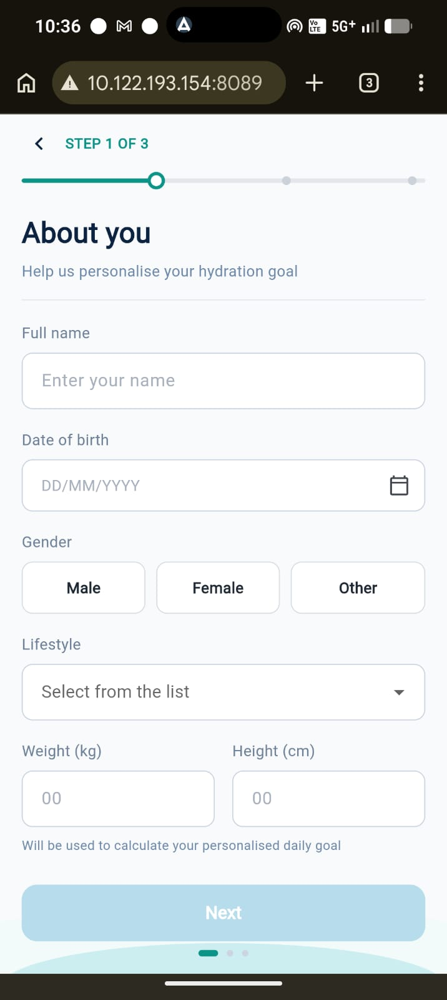
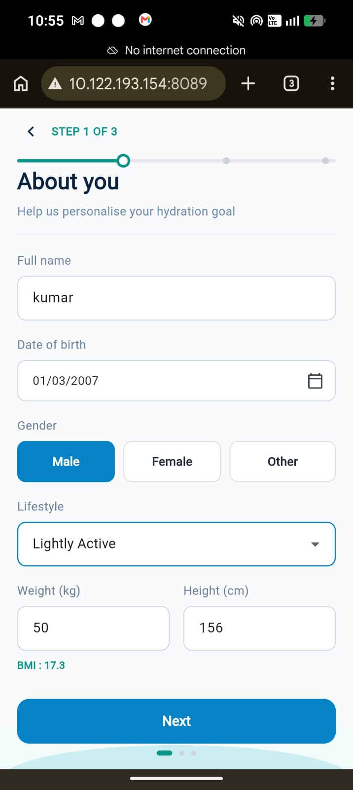
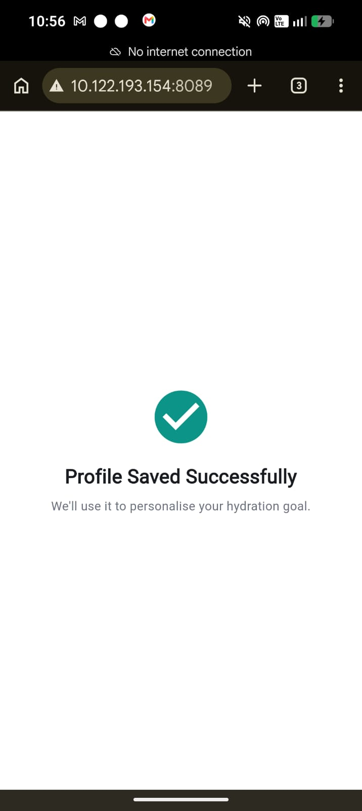

# ReverseAgeCode Onboarding

Flutter onboarding screen (Step 1 of 3) backed by a Node.js/Express API and MongoDB.

## Features

- Full name, date of birth, gender, lifestyle, weight, and height fields
- Required field validation (name min 2 chars, DOB can't be future, weight 20-300kg)
- Gender (Male/Female/Other) and Lifestyle (Sedentary/Lightly Active/Moderately Active/Very Active) selection
- Next button disabled until the whole form is valid
- Loading state while saving
- Success screen after save
- BMI auto-calculated from weight, using a hardcoded height of 170cm (per spec)
- Offline support: if the server can't be reached, the submission is saved on-device and retried automatically once the connection is back
- `POST /api/onboarding` and `GET /api/onboarding/:id`

## Tech Stack

- Mobile: Flutter, Dart, Provider
- Backend: Node.js, Express
- Database: MongoDB, Mongoose

## Packages Used

### Mobile (`mobile/pubspec.yaml`)

| Package | Why it's there |
| --- | --- |
| `provider` | State management — `OnboardingProvider` holds the form state and notifies the UI |
| `http` | Calls the backend (`POST`/`GET /api/onboarding`) |
| `connectivity_plus` | Detects when the device comes back online, to trigger the offline-retry |
| `shared_preferences` | Stores the pending submission on-device when the backend is unreachable |
| `cupertino_icons` | Default Flutter icon set (comes with the starter template) |
| `flutter_lints` (dev) | Lint rules, used by `flutter analyze` |

### Backend (`backend/package.json`)

| Package | Why it's there |
| --- | --- |
| `express` | HTTP server and routing |
| `mongoose` | MongoDB models, schema validation (required fields, enums, min/max) |
| `cors` | Lets the Flutter web build (running on a different port) call the API |
| `dotenv` | Loads `PORT` and `MONGODB_URI` from `.env` |
| `nodemon` (dev) | Auto-restarts the server while developing |

## Project Structure

```text
backend/
  src/
    controllers/
    middleware/
    models/
    routes/
  server.js

mobile/
  lib/
    models/
    providers/
    screens/
    services/
    utils/
    widgets/
    main.dart
```

## How to Run

### Backend

```bash
cd backend
npm install
cp .env.example .env
npm start
```

`.env`:

```env
PORT=5000
MONGODB_URI=mongodb://127.0.0.1:27017/reverseagecode
```

Needs a MongoDB instance running locally (or update `MONGODB_URI` to point at one). Easiest local option:

```bash
docker run -d --name reverseage-mongo -p 27017:27017 mongo:7
```

### Mobile

```bash
cd mobile
flutter pub get
flutter run
```

The app calls the backend at a fixed host/port in `lib/services/onboarding_service.dart`:

```dart
const host = "10.122.193.154";
return "http://$host:5000/api/onboarding";
```

If you're running on an emulator or a different network, change `host` to whichever address can actually reach your machine:
- Android emulator: `10.0.2.2`
- iOS simulator: `localhost`
- Physical device / phone browser: your computer's LAN IP (find it with `hostname -I` or `ip addr`)

After changing it, run `flutter pub get` again if needed and restart the app (or `flutter build web` if you're testing through a browser).

## API Endpoints

### POST `/api/onboarding`

Request:

```json
{
  "name": "John Doe",
  "dob": "1995-06-18",
  "gender": "Male",
  "lifestyle": "Moderately Active",
  "weight": 72,
  "height": 175
}
```

Response (201):

```json
{
  "success": true,
  "message": "Profile created",
  "id": "6a3f460dce3bf881a23c7716"
}
```

Validation errors return 400 with a list of messages. Example:

```json
{
  "success": false,
  "errors": ["Weight is required", "Height is required"]
}
```

### GET `/api/onboarding/:id`

Response (200):

```json
{
  "success": true,
  "data": {
    "_id": "6a3f460dce3bf881a23c7716",
    "name": "John Doe",
    "dob": "1995-06-18T00:00:00.000Z",
    "gender": "Male",
    "lifestyle": "Moderately Active",
    "weight": 72,
    "height": 175,
    "createdAt": "2026-06-27T03:39:57.078Z",
    "updatedAt": "2026-06-27T03:39:57.078Z"
  }
}
```

Returns 404 if the id doesn't exist or isn't a valid ObjectId.

## Database Schema

MongoDB collection: `onboardings`

| Field | Type | Validation |
| --- | --- | --- |
| `_id` | ObjectId | Auto generated |
| `name` | String | Required, minimum 2 characters |
| `dob` | Date | Required, not a future date |
| `gender` | String | One of Male, Female, Other |
| `lifestyle` | String | One of Sedentary, Lightly Active, Moderately Active, Very Active |
| `weight` | Number | Required, 20-300 |
| `height` | Number | Required, 50-250 |
| `createdAt` | Date | Auto generated |
| `updatedAt` | Date | Auto generated |

## Screenshots

**Empty form**



**Filled form with BMI**



**Success screen**


